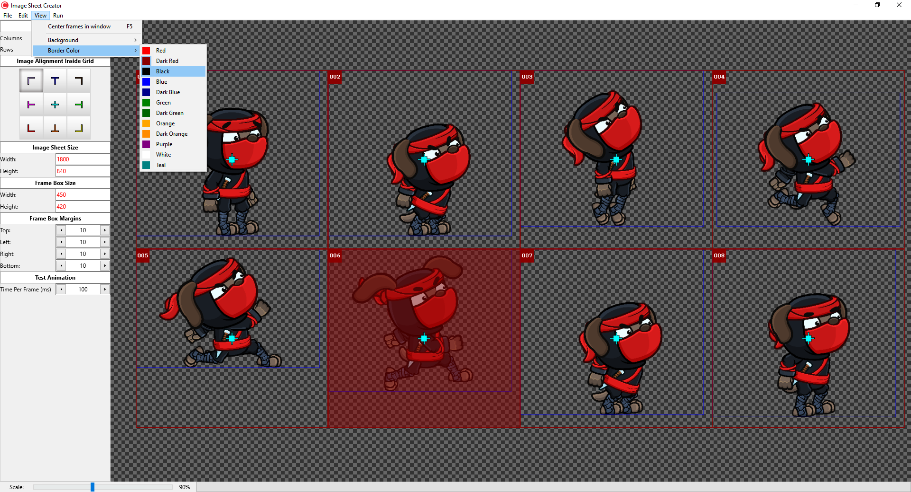
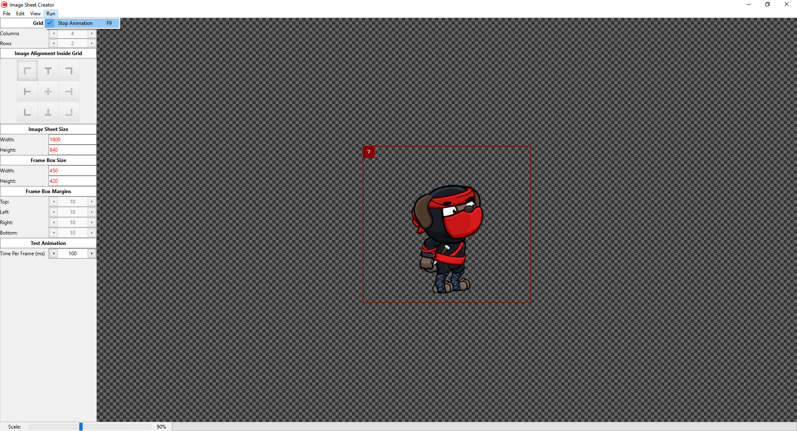

> Pictures of the editor in use.

# Image Sheet Creator
Create simple Sprite sheet / Image sheets from individual animation frame files. (PNG)

This software is in the early stages of development. It is usable in its current
state. This tool was created to assist game development using Solar2D by working for
the exported image files from <b>Brash Monkey's Spriter</b>.

# Building Image Sheet Creator
Embarcadero's C++ Builder 10.4 Free Community version is used to build a working version of this
program for windows. There is built in support for MAC, but not yet tested as I do not own a MAC.

Feel free to modify this program to fit your needs. I will monitor any and all pull requests
and attempt to update the source accordingly.

# Purpose
This tool is used to produce simple Image / Sprite sheets for character animations and such.
It allows for centering of animations and alignment to 8 different corners and sides within an image frame.
Adding a margin to each of the four sides of these image frames allows for a user to create equally
sized animation frames (Same size Widths and Heights) or maintain the current aspect ratio.

# Contributing
If you are willing to improve <b>Image Sheet Creator</b> by contributing code, by all means, fork this repository and create a pull request with any desired improvements.

# Creator
<b>Image Sheet Creator</b> is maintained by me, John Charles, <a href = "https://www.twitter.com/CodeIsLife101">CodeIsLife101</a> on twitter and I can be found
under the same name here: <a href = "https://t.co/Wx1BfiNx9Y">Shibori Clan: Shib Ninja Token</a> on Telegram, <a href = "https://discord.gg/4FFXcmeg">Discord</a>. Feel free to stop by and say hello!

